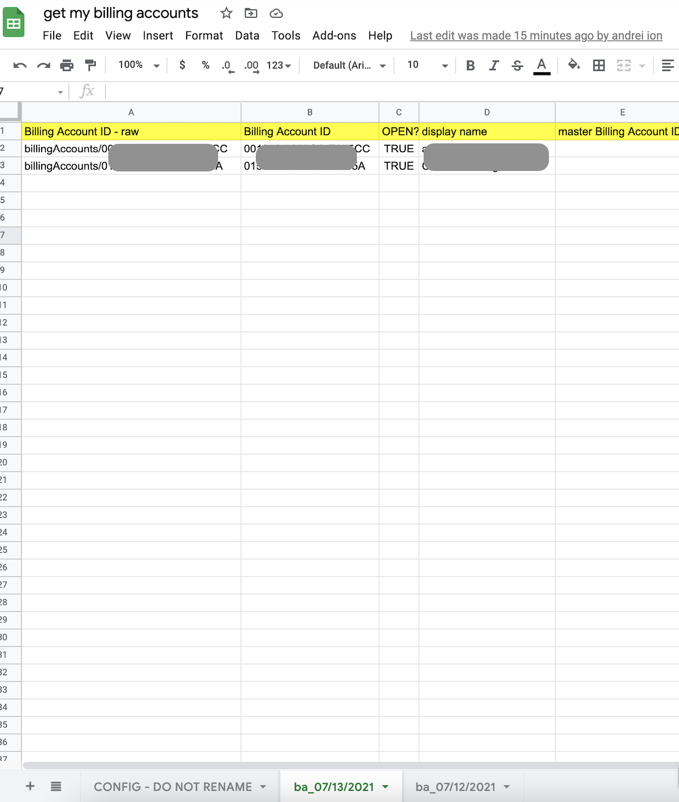
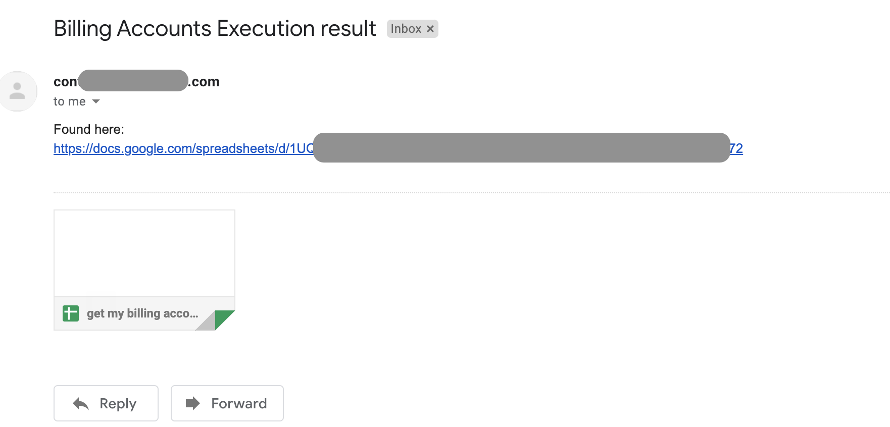

<h1>use this at your own risk</h1>

Automates Pulling of the GCP Billing Accounts that the user has access to

Can be configured to run on a schedule (for example weekly)

Sends an email after each execution to a configurable list of email addresses, with a link to the latest pull.

Can be useful for GCP Billing Admins or reseller Billing Admins with many accounts to track.

Leverages Billing Account API https://cloud.google.com/billing/docs/reference/rest/v1/billingAccounts/list

set up:
1. create a Sheets
2. name the first Sheet in it as "CONFIG - DO NOT RENAME"
3. in that sheet, on column C, add "emails to notify on execution" in C1
4. in C2 and subsequent add any email addresses you'd like to receive a notification of finish
5. Click on Tools -> Script Editor
6. paste the content in Code.gs
7. In AppScript go to Settings -> Show "appsscript.json" manifest file in editor
8. go back to the app script editor, paste the content of appscript.json from github in the one on the script.
9. find out GCP project id and enable billing API

From console.cloud.google.com

open cloud shell

gcloud projects describe 954759728445

-> get the projectId from the projectId line of the output -> in my case sys-555555555555555555555

gcloud services enable cloudbilling.googleapis.com  --project sys-555555555555555555555

10. Schedule execution

In appscript go to Trigers and set a Time-based one up